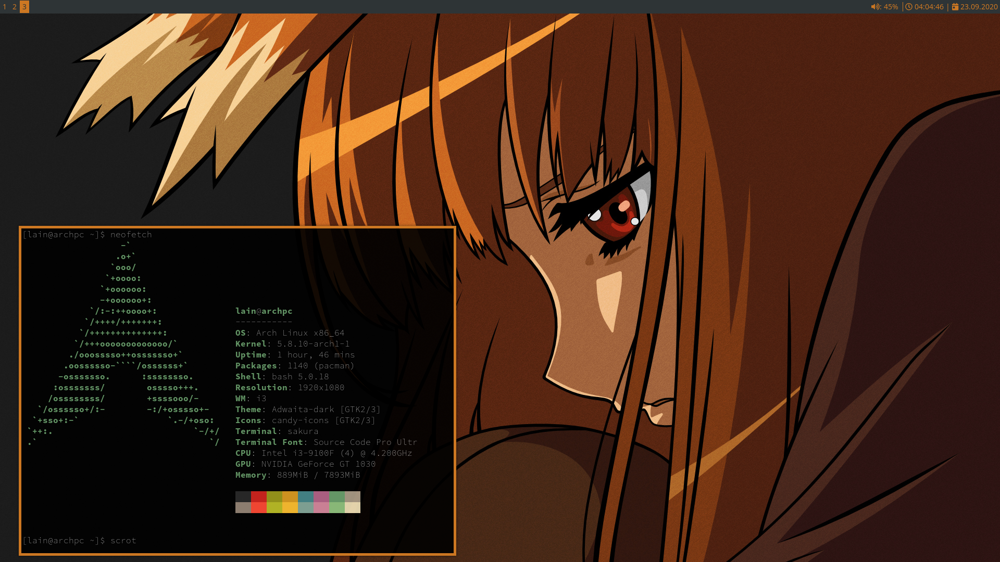

# bronybro_i3wm
i3, i3status and conky .config files  

Resolution of using monitor: 1920х1080 

<h1>i3 config</h1>
Directory for i3 config file:  

    ~/.config/i3/config 
  
<h1>i3status.conf</h1>
Directories for i3status.conf file:  

    ~/.config/i3status/config (or $XDG_CONFIG_HOME/i3status/config if set)
    
    /etc/xdg/i3status/config (or $XDG_CONFIG_DIRS/i3status/config if set)
    
    ~/.i3status.conf
    
    /etc/i3status.conf  
    
<h1>.conkyrc</h1>
Directories for conkyrc file:  

    /etc/conky/conky.conf 
    
    ~/.conkyrc 
    

